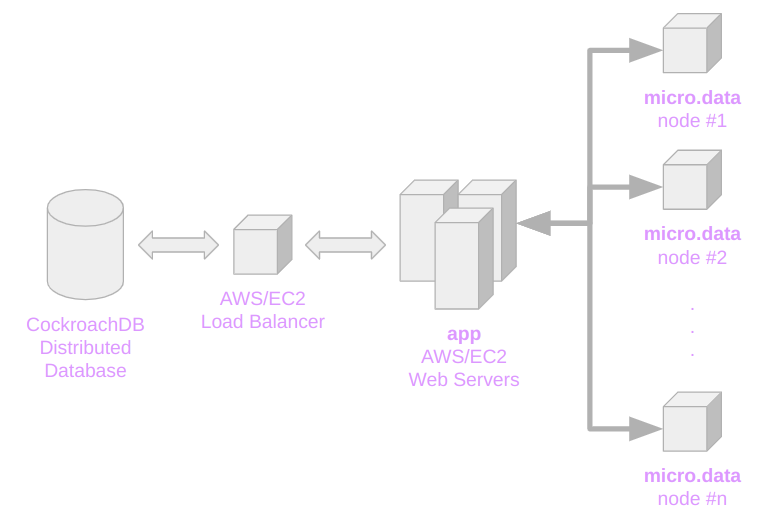
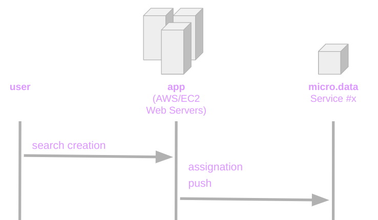
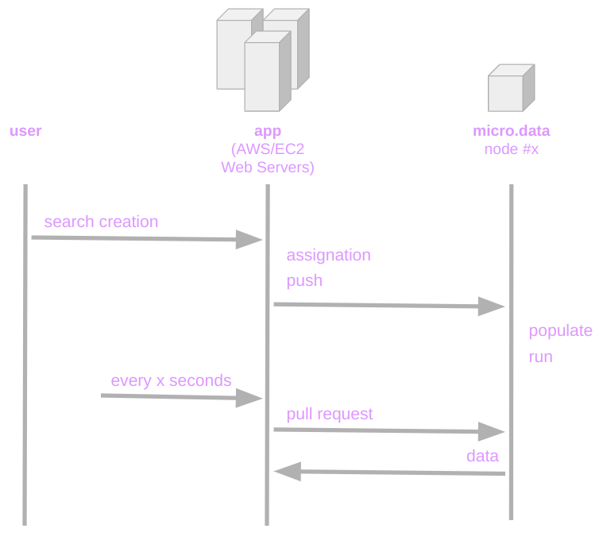

# docs

Documentation of the [FreeLeadsData](https://freeleadsdata.com) project.

**Outline:**

1. [Overview](1-overview)
2. [Serialization](2-serialization)
3. [Protocol](3-protocol)
4. [Events](4-events)

## 1. Overview

[FreeLeadsData](https://freeleadsdata.com) is B2B data service that provides the following features:

- Leads Scraping.
- Email Appending & Verification.
- Company Websites Scraping for AI Insights Filtering.
- API for connecting with other scrapers and enrich data.

[FreeLeadsData](https://freeleadsdata.com) is designed for:

1. scaling with no limit by following a micro.services architecture; and
2. reducing costs at minimum.

The general architecture looks like this:



1. We use [CockroachDB](https://www.cockroachlabs.com/) for storing data into scalable and serverless database.

2. We use AWS/EC2 for managing a scalable web server for our app. Each AWS/EC2 instance run a FreeLeadsData [app](https://github.com/FreeLeadsData/app). Such an **app** us a fork of [my.saas](https://github.com/leandrosardi/my.saas). 

3. The offline processing is being handled by a micro-service called [micro.data](https://github.com/FreeLeadsData/micro.data). Such a **micro.data** service is a fork of [micro.template](https://github.com/leandrosardi/micro.template).

## 2. Serialization

Any search can be serialized with a `json` descriptor like below.

For a full documentation of search descriptor, refer to [this document](./doc/1-serialization.md).

```ruby
h = {
    'name' => name,
    'stop_limit' => 999999, # 400 million
    'status' => true,
    'verify_email' => true, 
    'direct_phone_number_only' => false,

    'job_titles' => [
        # job positions to include
        { 'value' => 'Owner', 'positive' => true },
        { 'value' => 'CEO', 'positive' => true },
        { 'value' => 'Founder', 'positive' => true },
        { 'value' => 'President', 'positive' => true },
        { 'value' => 'Director', 'positive' => true },
    ],

    'states' => [
        # locations to include
        { 'value' => 'FL', 'positive' => true }, 
    ],

    'industries' => [
        # industries to include
        { 'value' => 'Real Estate', 'positive' => true },
    ],

    'company_headcounts' => [
        # headcounts to include
        { 'value' => '1 to 10', 'positive' => true },
        { 'value' => '11 to 25', 'positive' => true },
        { 'value' => '26 to 50', 'positive' => true },
    ],

    'company_names' => ['Xerox', 'Google', 'Microsoft'],
}
```

## 3. Protocol

When a **user** create a new search in the **app**, such a search is:

1. assigned to a **micro.data** node; and then
2. pushed to such a **node**.



While the node is 

- **populating** the search (with leads that match with thefilters); and

- **running** other tasks (like **scraping** website, **appending** website insights using AI, **verifying** emails, **exporting** results to a CSV, and **draining** processed results); 

the app may request an update to the node every `x` seconds.



In the **pull request**, the node returns an array of all the searches that deserver to be updated at the app side.

The information pulled from the node is the statistics of the process, and the URL of the export file (the data).

## 4. Events

There are some events that make the app pushing a search to the node:

- when the search is created (obviously);
- when the search is updated;
- when the accounts has new credits;
- when the any other search of the same account has been just pulled (so the **credits** and **daily quota** such an account changed).

## 5. Best Practices

### 5.1. Select fields you are going to update only. 

```ruby
l.logs "Updating stats of #{id}... "
s = BlackStack::MicroData::Zi::Search.select(
    :id, :export_time, :export_download_url, :export_filename
).where(:id=>id).first

s..export(to, l) # ==> self.export_time = to
l.logf 'done'.green
```

Other fields must being loaded by raw query.

```ruby
l.logs "Upload the file... "
search_name = DB["SELECT name FROM zi_search WHERE id='#{self.id}'"].first[:name]
cloud_filename = "#{search_name}.#{self.id}"
res = BlackStack::DropBox.dropbox_upload_file(local_filename, "/#{DROPBOX_FOLDER}/#{cloud_filename}")
l.done

# set last export time
s.export_time = now
```

So, you won't over-write fields that may be updated by another process.

```ruby
# update record
s.save
```